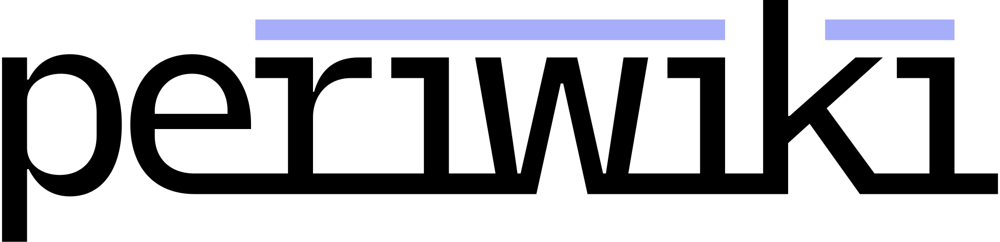

MediaWiki-inspired, [Goldmark](https://github.com/yuin/goldmark) powered wiki written in Go with an SQLite backend.

## Why?
Because I don't like managing PHP installations.

There are a ton of "Hello World" wikis written in Go out there<sup>1</sup>. The longterm goal is be a serious, lightweight, (maybe fast) alternative to MediaWiki for smaller, simple wikis.

## What's with the name?
periwiki<sup>2</sup> is a [portmanteau](https://en.wikipedia.org/wiki/Portmanteau) of periwinkle and wiki. I pronounce it /periwɪki/ and spell it **periwiki**.

## It sort of looks like MediaWiki
That is not an accident. It is what a wiki should look like.

## What's the license?
The [Mozilla Public License](LICENSE). Share what you do with it!

## Build/Run
Requirements: `make`, `sqlite3`, and `go`. `sass` is optional unless you make any edits to the .scss as a compiled .css file is included. 

```bash
git clone github.com/danielledeleo/periwiki

make
make run

```

## Anything else?
See [TODO](docs/TODO.md) for a little insight on what's on the road map.

<sub>1: Mostly because of this wonderful intro to Go web apps, [Writing Web Applications](https://golang.org/doc/articles/wiki/).</sub>

<sub>2: This project [used to be called iwikii](https://github.com/danielledeleo/periwiki/commit/1cab3f24ae07390975d06be4343b7b3deea11cad).</sub>
