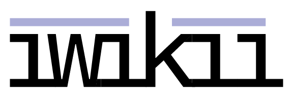

A shameless clone of MediaWiki written in Go.

## Why?
Because I don't like managing a PHP installation.

There are a ton of "Hello World" wikis written in Go out there1. What makes iwikii different is that it aims to be a serious, lightweight, alternative to MediaWiki for simple wikis.

## What's with the name?
It came from Namelix's neat machine learning name generator. I pronounce it /ɪwɪki/.

## Whoa, it looks like MediaWiki
iwikii borrows common wiki design elements to keep things familiar and easy to use.

## What license are you using?
I was [thiiiis close](https://en.wikipedia.org/wiki/Millimeter) to using a GPL license, but a little voice told me: "hey but what if someone at a big corp wants to use iwikii but they aren't allowed to?", so I decided on Mozilla Public License. Share what you do with it!

## Build/Run
Requirements: `make` and `go`. `sass` is optional unless you make any edits to the .scss as a .css is included. 

`go get github.com/jagger27/iwikii`
`cd $GOPATH/src/github.com/jagger27/iwikii`
`make` (or just `go build`)
`./iwikii`

<small>1: Mostly because of this wonderful intro to Go web apps, [Writing Web Applications](https://golang.org/doc/articles/wiki/).</small>
