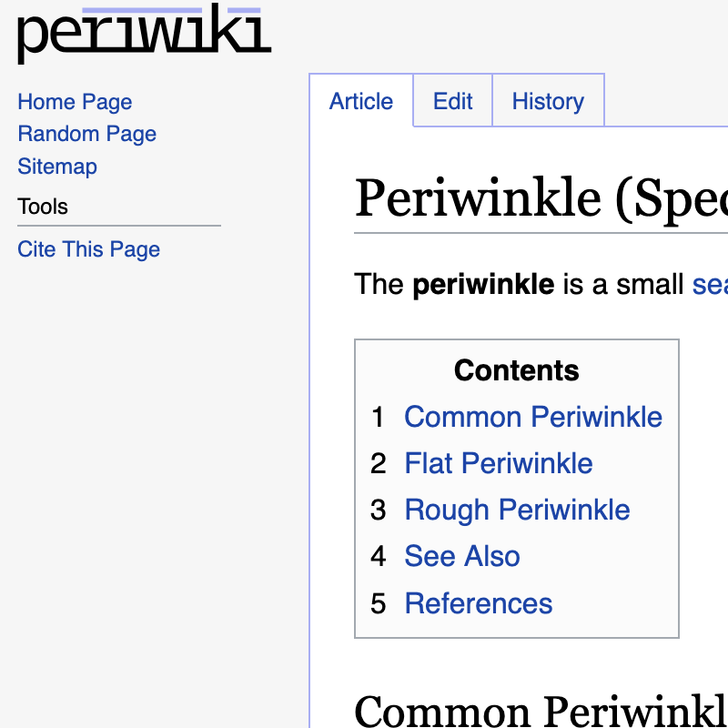

A self-hosted wiki for people who miss the old web.

**[→ Try the live demo](https://demo.peri.wiki)** — runs entirely in your browser via WebAssembly.

MediaWiki-inspired, [Goldmark](https://github.com/yuin/goldmark)-powered wiki written in Go with SQLite. No JavaScript, cache-friendly server-rendered HTML, no fuss. Built for passion projects, small teams, and personal knowledge bases.

## Features

- **CommonMark extended with WikiLinks** — Standard Markdown plus `[[Wikilink]]` syntax to connect articles
- **Full revision history** — Every edit is saved, with diffs between any two versions
- **User accounts with optional anonymous editing** — Authentication if you need it, open contribution if you don't
- **Self-contained binary** — Runs from a single binary, get started instantly

## Quick Start

Requirements: `go` and `make`

```bash
git clone https://github.com/danielledeleo/periwiki
cd periwiki
make && ./periwiki
```

## [Documentation](docs/index.md)

- [Installation and Configuration](docs/installation-and-configuration.md)
- [Writing Articles](docs/writing-articles.md)
- [Troubleshooting](docs/troubleshooting.md)

## It looks like MediaWiki

That is not an accident. It is what a wiki should look like. 

[](https://raw.githubusercontent.com/danielledeleo/periwiki/refs/heads/main/docs/screenshot.png)

_Click to enlarge_


## What's with the name?

Periwiki<sup>1</sup> is a [portmanteau](https://en.wikipedia.org/wiki/Portmanteau) of periwinkle and wiki. I pronounce it /periwɪki/ and style it **periwiki**.

## License

[GNU Affero General Public License v3.0](LICENSE)

---

<sub>1: This project [used to be called iwikii](https://github.com/danielledeleo/periwiki/commit/1cab3f24ae07390975d06be4343b7b3deea11cad).</sub>
